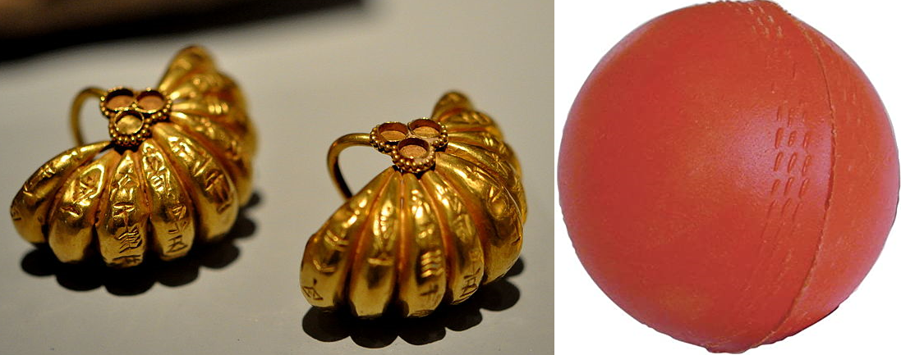
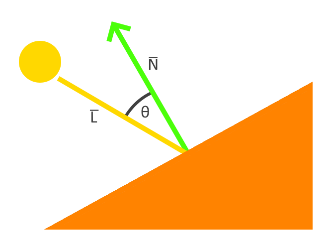
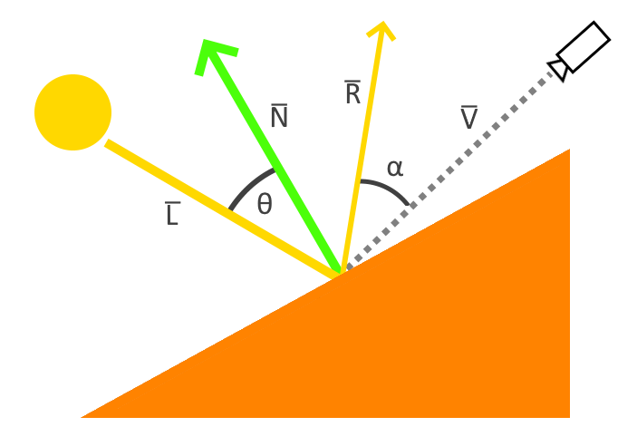
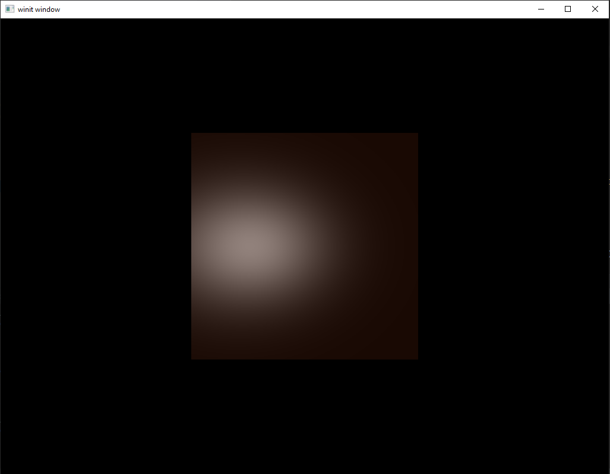
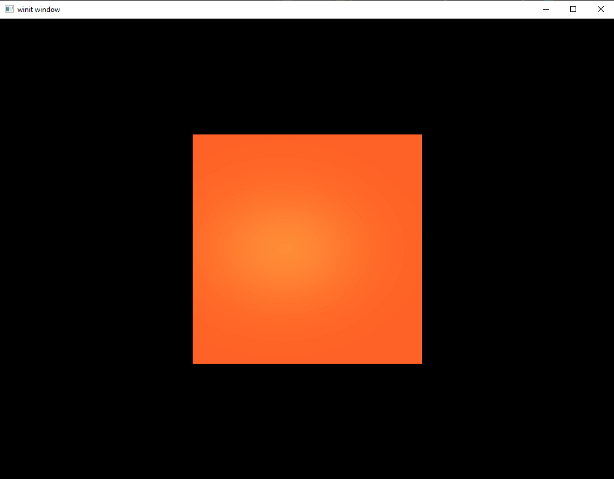
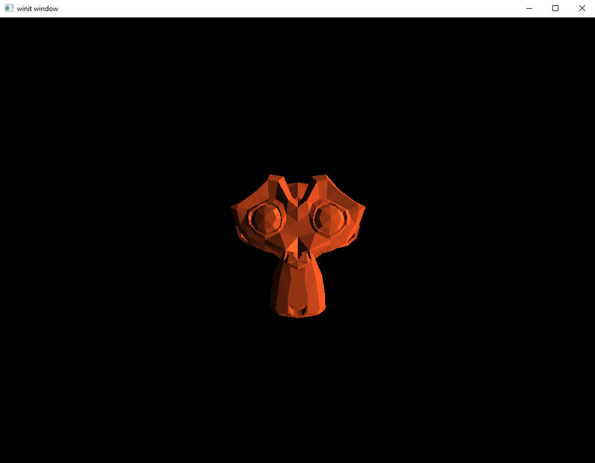
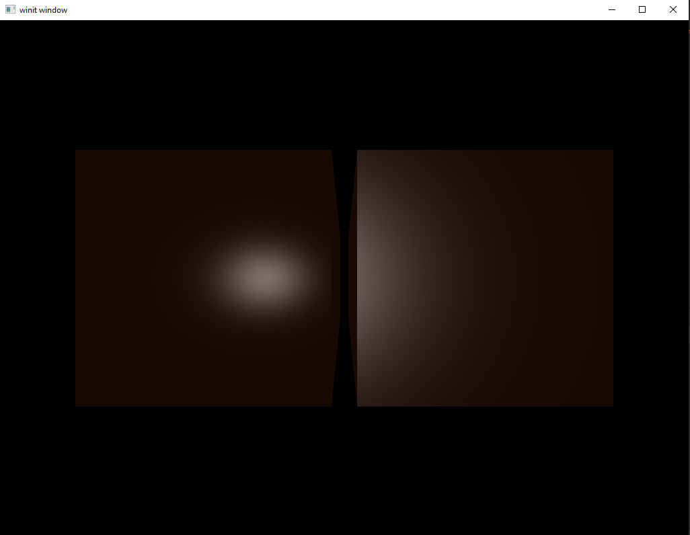
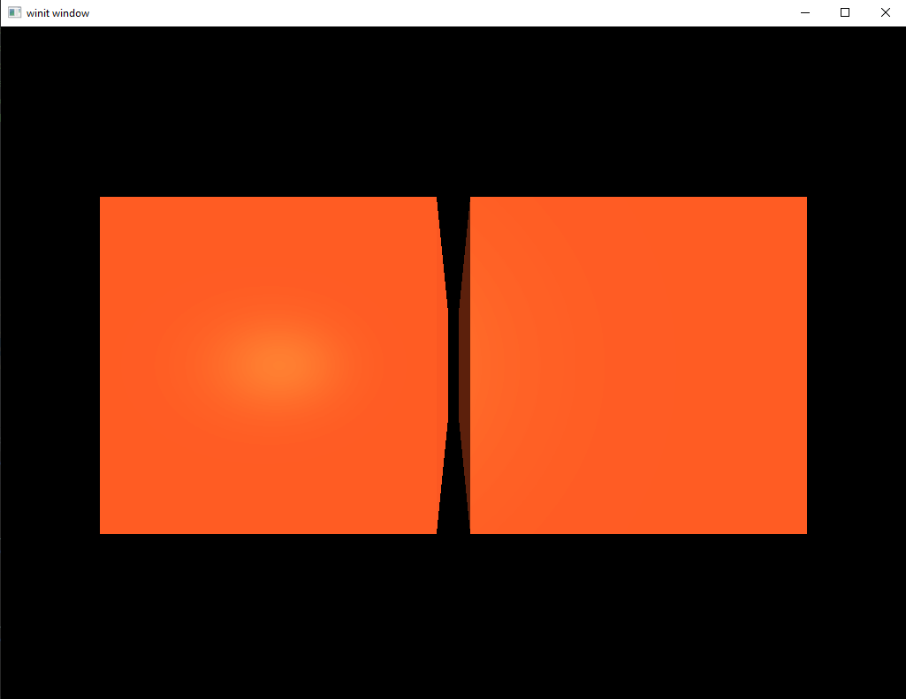

# Specular Lights

So far, we've made due with a simplified lighting system that only considers the ambient light and the direction-based intensity of individual light sources. This is just fine for our purposes and, to be honest, we could probably get through everything else I want to put in these tutorials with just this. However, since we're discussing lights already we might as well add the component we're missing: *specular lighting*.

[Specular lighting](https://en.wikipedia.org/wiki/Specular_highlight) is a relatively simple component of light shading but one that really helps bring scenes to life. To put it simply, it is the "shininess" of a material.

Consider the following image. 



On one side we have ancient gold earrings as seen in a museum and on the other we have a product picture of a rubber ball for sale on Amazon. Both are well-lit with the main light being above and to the side compared to the camera. If we were to render models of these objects in our rendering system as it exists now both the gold and the rubber would have the same level of "shininess" and would look much the same over all. But that's clearly not how it works in real life. This lesson will look at how we can make our rendering system output something at least a little closer to reality.

### But What is it, Really?

For the first time in this tutorial series I'm going to resort to mathematical diagrams to illustrate the point. The following depicts what we have been doing so far.



This diagram shows our vertex as an orange triangle. The vertex normal is represented by a green arrow and labeled `N̅`. Our light source is represented by a yellow circle and is casting a ray, `L̅`, towards our vertex. The angle between the two is labeled with the Greek letter theta, `θ`, and is what we use to calculate the *directional intensity* of the light.

The smaller `θ` is, the closer our light source is to being directly over head from the perspective of the vertex. When `θ` is 0 then `N̅` and `L̅` are the same and our light is shining as directly as possible on the vertex.

This is, no doubt, very fascinating but is only half of the scene. After all, what happens to the light after it hits the surface? And where is the viewer in this case?

The full version of the diagram, and the one we will be implementing in this lesson, is this:



When the light ray `L̅` strikes the surface it is reflected off. In the above diagram we've labeled this *reflection vector* with `R̅`. We've also added a camera off to one side. This camera represents where the *viewer* position is relative to the surface. We've marked the vector from the camera to the surface with a dotted line labeled `V̅`. The angle between the reflection vector and the view vector we've labeled alpha, `α`.

Much like `θ`, the smaller `α` becomes, the more intense the light is. We can see this by picturing what the diagram would be like if `α` were 0. In that case, the reflection vector would be shining directly into the camera. The added light intensity from `α` produces what are called *specular highlights* and are the focus of this lesson. 


## Updating Our Code

#### Adding Render Attachments

To implement specular lighting as outlined in the [opengl lighting tutorial](https://learnopengl.com/Lighting/Basic-Lighting) we've been following we'll need to start tracking two different types of information:
 1. A two-part specular component including the intensity of the specular highlights and the "shininess" value
 2. The location of the transformed fragment location, which we need to find the reflection vector

There are a couple of approaches we could use. The most common approach is to use textures; however, we have not yet introduced textures to our rendering system yet. So instead of textures, we will be storing this information as new *render-pass attachments*. The attachment intended to hold the frag location data will need to store a four-element vector but the specular information attachment can use a two-element floating point vector instead.

`system`
```rust
pub struct System {
    // ...
    frag_location_buffer: Arc<ImageView<Arc<AttachmentImage>>>,
    specular_buffer: Arc<ImageView<Arc<AttachmentImage>>>,
    // ...
}

impl System {
    pub fn new(event_loop: &EventLoop<()>) -> System  {
        // ...
        let render_pass = vulkano::ordered_passes_renderpass!(device.clone(),
                attachments: {
                    final_color: {
                        load: Clear,
                        store: Store,
                        format: swapchain.format(),
                        samples: 1,
                    },
                    color: {
                        load: Clear,
                        store: DontCare,
                        format: Format::A2B10G10R10_UNORM_PACK32,
                        samples: 1,
                    },
                    normals: {
                        load: Clear,
                        store: DontCare,
                        format: Format::R16G16B16A16_SFLOAT,
                        samples: 1,
                    },
                    frag_location: {
                        load: Clear,
                        store: DontCare,
                        format: Format::R16G16B16A16_SFLOAT,
                        samples: 1,
                    },
                    specular: {
                        load: Clear,
                        store: DontCare,
                        format: Format::R16G16_SFLOAT,
                        samples: 1,
                    },
                    depth: {
                        load: Clear,
                        store: DontCare,
                        format: Format::D16_UNORM,
                        samples: 1,
                    }
                },
                passes: [
                    {
                        color: [color, normals, frag_location, specular],
                        depth_stencil: {depth},
                        input: []
                    },
                    {
                        color: [final_color],
                        depth_stencil: {depth},
                        input: [color, normals, frag_location, specular]
                    }
                ]
            )
            .unwrap();
        // ...
        let (framebuffers, color_buffer, normal_buffer, frag_location_buffer, specular_buffer) =
            System::window_size_dependent_setup(
                device.clone(),
                &images,
                render_pass.clone(),
                &mut viewport,
            );
        // ...
        System{
            //...
            frag_location_buffer,
            specular_buffer,
            //...
        }
    }

    fn window_size_dependent_setup(
        device: Arc<Device>,
        images: &[Arc<SwapchainImage<Window>>],
        render_pass: Arc<RenderPass>,
        viewport: &mut Viewport,
    ) -> (
        Vec<Arc<Framebuffer>>,
        Arc<ImageView<AttachmentImage>>,
        Arc<ImageView<AttachmentImage>>,
        Arc<ImageView<AttachmentImage>>,
        Arc<ImageView<AttachmentImage>>,
    ) {
        let dimensions = images[0].dimensions().width_height();
        viewport.dimensions = [dimensions[0] as f32, dimensions[1] as f32];

        let color_buffer = ImageView::new(
            AttachmentImage::transient_input_attachment(
                device.clone(),
                dimensions,
                Format::A2B10G10R10_UNORM_PACK32,
            )
            .unwrap(),
        )
        .unwrap();
        let normal_buffer = ImageView::new(
            AttachmentImage::transient_input_attachment(
                device.clone(),
                dimensions,
                Format::R16G16B16A16_SFLOAT,
            )
            .unwrap(),
        )
        .unwrap();

        let frag_location_buffer = ImageView::new(
            AttachmentImage::transient_input_attachment(
                device.clone(),
                dimensions,
                Format::R16G16B16A16_SFLOAT,
            )
            .unwrap(),
        )
        .unwrap();
        let specular_buffer = ImageView::new(
            AttachmentImage::transient_input_attachment(
                device.clone(),
                dimensions,
                Format::R16G16_SFLOAT,
            )
            .unwrap(),
        )
        .unwrap();

        (
            images
                .iter()
                .map(|image| {
                    let view = ImageView::new(image.clone()).unwrap();
                    let depth_buffer = ImageView::new(
                        AttachmentImage::transient(device.clone(), dimensions, Format::D16_UNORM)
                            .unwrap(),
                    )
                    .unwrap();
                    Framebuffer::start(render_pass.clone())
                        .add(view)
                        .unwrap()
                        .add(color_buffer.clone())
                        .unwrap()
                        .add(normal_buffer.clone())
                        .unwrap()
                        .add(frag_location_buffer.clone())
                        .unwrap()
                        .add(specular_buffer.clone())
                        .unwrap()
                        .add(depth_buffer.clone())
                        .unwrap()
                        .build()
                        .unwrap()
                })
                .collect::<Vec<_>>(),
            color_buffer.clone(),
            normal_buffer.clone(),
            frag_location_buffer.clone(),
            specular_buffer.clone(),
        )
    }
}
```

Note that we also added our new buffers to the sub-pass input and outputs as appropriate. Both attachments will be used as output targets in the geometry sub-pass and will be used as input attachments in our lighting sub-pass.

We need to be able to find the camera's position for the following math to work right, so let's update our `VP` struct to store that information.

`system.rs`
```rust
#[derive(Debug, Clone)]
struct VP {
    view: TMat4<f32>,
    projection: TMat4<f32>,
    camera_pos: TVec3<f32>,
}

impl VP {
    fn new() -> VP {
        VP {
            view: identity(),
            projection: identity(),
            camera_pos: vec3(0.0, 0.0, 0.0)
        }
    }
}

impl System {
    pub fn set_view(&mut self, view: &TMat4<f32>) {
        self.vp.view = view.clone();
        let look =  inverse(&view);
        self.vp.camera_pos = vec3(look[12], look[13], look[14]);
        //...
    }
}
```

Next, let's update the rendering code to use the new buffers as well as adding a new camera data uniform that will be passed to the directional lighting shader and a specular data uniform that will be passed to the geometry shader.

`system.rs`
```rust
impl System {
    pub fn directional(&mut self, directional_light: &DirectionalLight) {
        //...
        let camera_buffer = CpuAccessibleBuffer::from_data(
            self.device.clone(),
            BufferUsage::all(),
            false,
            directional_frag::ty::Camera_Data {
                position: self.vp.camera_pos.into(),
            }
        ).unwrap();
        let directional_layout = self
            .directional_pipeline
            .layout()
            .descriptor_set_layouts()
            .get(0)
            .unwrap();
        let directional_set = PersistentDescriptorSet::new(
            directional_layout.clone(),
            [
                WriteDescriptorSet::image_view(0, self.color_buffer.clone()),
                WriteDescriptorSet::image_view(1, self.normal_buffer.clone()),
                WriteDescriptorSet::image_view(2, self.frag_location_buffer.clone()),
                WriteDescriptorSet::image_view(3, self.specular_buffer.clone()),
                WriteDescriptorSet::buffer(4, directional_uniform_subbuffer.clone()),
                WriteDescriptorSet::buffer(5, camera_buffer.clone()),
            ],
        )
        .unwrap();
        //...
    }

    pub fn geometry(&mut self, model: &mut Model) {
        //...
        let specular_buffer = CpuAccessibleBuffer::from_data(
            self.device.clone(),
            BufferUsage::all(),
            false,
            deferred_frag::ty::Specular_Data {
                intensity: 0.5,
                shininess: 32.0,
            }
        ).unwrap();
        
        let deferred_layout_model = self
            .deferred_pipeline
            .layout()
            .descriptor_set_layouts()
            .get(1)
            .unwrap();
        let model_set = PersistentDescriptorSet::new(
            deferred_layout_model.clone(),
            [
                WriteDescriptorSet::buffer(0, model_uniform_subbuffer.clone()),
                WriteDescriptorSet::buffer(1, specular_buffer.clone()),
            ],
        )
        .unwrap();
        //...
    }

    pub fn start(&mut self) {
        //...
        let clear_values = vec![[0.0, 0.0, 0.0, 1.0].into(), [0.0, 0.0, 0.0, 1.0].into(), [0.0, 0.0, 0.0, 1.0].into(), [0.0, 0.0, 0.0, 1.0].into(), [0.0, 0.0].into(), 1f32.into()];
        //...
    }
    
    pub fn recreate_swapchain(&mut self) {
        //...
        let (
            new_framebuffers,
            new_color_buffer,
            new_normal_buffer,
            new_frag_location_buffer,
            new_specular_buffer,
        ) = System::window_size_dependent_setup(
            self.device.clone(),
            &new_images,
            self.render_pass.clone(),
            &mut self.viewport,
        );
        self.framebuffers = new_framebuffers;
        self.color_buffer = new_color_buffer;
        self.normal_buffer = new_normal_buffer;
        self.frag_location_buffer = new_frag_location_buffer;
        self.specular_buffer = new_specular_buffer;
        //...
    }
}
```

We aren't doing anything we haven't seen before, just updating the different attachments and uniforms we want to use. It's not hard but it does involve a lot of paperwork with little details that are pretty easy to forget. That said, nothing too complex is happening here. For now we're hard-coding our specular data for the sake of convenience but we'll revisit this later. 

#### Updating Our Shaders

Lots of math here that I won't pause to explain beyond the earlier section. I encourage you to read the explanations at the [tutorial this one is based on](https://learnopengl.com/Lighting/Basic-Lighting) for a more in-depth walkthrough of the math.

`deferred.vert`
```glsl
#version 450

layout(location = 0) in vec3 position;
layout(location = 1) in vec3 normal;
layout(location = 2) in vec3 color;

layout(location = 0) out vec3 out_color;
layout(location = 1) out vec3 out_normal;
layout(location = 2) out vec4 out_location;

layout(set = 0, binding = 0) uniform VP_Data {
    mat4 view;
    mat4 projection;
} vp_uniforms;

layout(set = 1, binding = 0) uniform Model_Data {
    mat4 model;
    mat4 normals;
} model;

void main() {
    vec4 frag_pos = vp_uniforms.projection * vp_uniforms.view * model.model * vec4(position, 1.0);
    gl_Position = frag_pos;
    out_color = color;
    out_normal = mat3(model.normals) * normal;
    out_location = frag_pos;
}
```

`deferred.frag`
```glsl
#version 450
layout(location = 0) in vec3 in_color;
layout(location = 1) in vec3 in_normal;
layout(location = 2) in vec4 in_location;

layout(set = 1, binding = 1) uniform Specular_Data {
    float intensity;
    float shininess;
} specular;

layout(location = 0) out vec4 f_color;
layout(location = 1) out vec3 f_normal;
layout(location = 2) out vec4 f_location;
layout(location = 3) out vec2 f_specular;

void main() {
    f_color = vec4(in_color, 1.0);
    f_normal = in_normal;
    f_location = in_location;
    f_specular = vec2(specular.intensity, specular.shininess);
}
```

The main changes to our deferred shaders is the way that we are now writing the calculated location data to an attachment in addition to the `gl_Position` endpoint. Our fragment shader is also taking a new specular uniform input and recording it.

`directional.frag`
```glsl
#version 450

layout(input_attachment_index = 0, set = 0, binding = 0) uniform subpassInput u_color;
layout(input_attachment_index = 1, set = 0, binding = 1) uniform subpassInput u_normals;
layout(input_attachment_index = 1, set = 0, binding = 2) uniform subpassInput u_frag_location;
layout(input_attachment_index = 1, set = 0, binding = 3) uniform subpassInput u_specular;

layout(set = 0, binding = 4) uniform Directional_Light_Data {
    vec4 position;
    vec3 color;
} directional;

layout(set = 0, binding = 5) uniform Camera_Data {
    vec3 position;
} camera;

layout(location = 0) out vec4 f_color;

void main() {
    vec3 normal = subpassLoad(u_normals).xyz;
    float specular_intensity = subpassLoad(u_specular).x;
    float specular_shininess = subpassLoad(u_specular).y;
    vec3 view_dir = -normalize(camera.position - subpassLoad(u_frag_location).xyz);
    vec3 light_direction = normalize(directional.position.xyz + normal);
    vec3 reflect_dir = reflect(-light_direction, normal);
    float spec = pow(max(dot(view_dir, reflect_dir), 0.0), specular_shininess);
    vec3 specular = specular_intensity * spec * directional.color;
    float directional_intensity = max(dot(normal, light_direction), 0.0);
    vec3 directional_color = directional_intensity * directional.color;
    vec3 combined_color = (specular + directional_color) * subpassLoad(u_color).rgb;
    f_color = vec4(combined_color, 1.0);
}
```

Aside from some new math, nothing too exciting is happening here. However, make sure to pay attention to the binding values.

#### Running The Code

`main.rs`
```rust
fn main() {
    // ...
    let mut obj = Model::new("data/models/cube.obj").build();
    obj.translate(vec3(0.0, 0.0, -2.0));
    // ...
    let x: f32 = 3.0 * elapsed_as_radians.cos();
    let z: f32 = -2.0 + (3.0 * elapsed_as_radians.sin());

    let directional_light = DirectionalLight::new([x, 0.0, z, 1.0], [1.0, 1.0, 1.0]);
    // ...
    system.geometry(&mut obj);
    // ...
}
```

This sets the object as a cube close enough to the camera that the light passes behind us, the simplest case.

`directional.frag`
```glsl
void main() {
    //..
    //vec3 combined_color = (specular + directional_color) * subpassLoad(u_color).rgb;
    vec3 combined_color = specular;
    f_color = vec4(combined_color, 1.0);
}
```
comment out the combined code and just show the specular highlights and run the code.



This is what we're trying to find. The bright spot created when a light source shines onto a reflective object. The size and brightness of this spot are controlled by the specular data uniform we pass in to the deferred shader.

Now let's fix our shader so that it shows the correct combined view and run the code again.

`directional.frag`
```glsl
void main() {
    //..
    vec3 combined_color = (specular + directional_color) * subpassLoad(u_color).rgb;
    //vec3 combined_color = specular;
    f_color = vec4(combined_color, 1.0);
}
```



Looking good. Now, let's modify our code to use a more complicated model and do the same thing.

`main.rs`
```rust
fn main() {
    // ...
    let mut obj = Model::new("data/models/suzanne.obj").build();
    obj.translate(vec3(0.0, 0.0, -2.0));
    obj.rotate(3.14, vec3(0.0, 1.0, 0.0));
    // ...
}
```

Now run the program using only the specular highlights.


Now the same model with the full range of lighting turned on.



## One Last Thing

Right now, the specular data is all hard-coded. Let's update our `Model` class to store the data there. 

`Model.rs`
```rust
pub struct Model {
    //...
    specular_intensity: f32,
    shininess: f32,
}

pub struct ModelBuilder {
    //...
    specular_intensity: f32,
    shininess: f32,
}

impl ModelBuilder {
    fn new(file: String) -> ModelBuilder {
        ModelBuilder {
            //...
            specular_intensity: 0.5,
            shininess: 32.0,
        }
    }

    pub fn build(self) -> Model {
        Model {
            //...
            specular_intensity: self.specular_intensity,
            shininess: self.shininess,
        }
    }

    pub fn specular(mut self, specular_intensity: f32, shininess: f32) -> ModelBuilder {
        self.specular_intensity = specular_intensity;
        self.shininess = shininess;
        self
    }
}

impl Model {
    pub fn specular(&self) -> (f32, f32) {
        (self.specular_intensity.clone(), self.shininess.clone())
    }
}
```

A simple change to `System` is enough to use this dynamic input.

`system.rs`
```rust
impl System {
    pub fn geometry(&mut self, model: &mut Model) {
        //...
        let(intensity, shininess) = model.specular();
        let specular_buffer = CpuAccessibleBuffer::from_data(
            self.device.clone(),
            BufferUsage::all(),
            false,
            deferred_frag::ty::Specular_Data {
                intensity,
                shininess,
            }
        ).unwrap();
        //...
    }
}
```

If you run the code again you should now see the same image as in our last section.

#### Changing the specular values

Let's change things up a bit. Let's have two cubes side-by-side, one with a higher shininess value and one with a lower one.

`main.rs`
```rust
fn main() {
    //...
    let mut cube1 = Model::new("data/models/cube.obj").specular(0.5, 12.0).build();
    cube1.translate(vec3(1.1, 0.0, -2.0));

    let mut cube2 = Model::new("data/models/cube.obj").specular(0.5, 128.0).build();
    cube2.translate(vec3(-1.1, 0.0, -2.0));}
    //...
```

Let's also go back and edit the shader to only show the specular highlight again. If you've done that, then you should see something like this when you run the program.



At first glance this looks fine, but there is an oddity here. The cube we assigned the highest shininess too is the one on the left yet the one on the right *seems* brighter. What's going on?

This is an artifact from the fact that we've set the intensity to be the same. Think back to the picture of the gold and rubber objects at the beginning of the lesson. The shiny gold had small, intense highlights whereas the rubber had a dim but very wide highlight. If we return to using the full lighting model on the cubes, the seeming strangeness disappears and it becomes more obvious that the cube on the left his shinier than the one on the right.



## What Next?

Next we're moving on to a topic that usually shows up much earlier in graphics tutorials: textures. As a briefly hinted at earlier in this lesson, textures are often used in lighting systems for specular and normal data. This is very useful as it helps produce scenes which have a much higher quality of lighting than our relatively primitive per-vertex shading can handle.

So will this tutorial series revisit the topic of lighting once we've mastered textures? No. As I write this, at least, I have no plans to revisit lighting at all past this point. The reason for this is the same reason I left textures so late. Although these lessons are intended to provide an introduction to graphics programming the focus has always been on how to do graphics programming *with Vulkan*. As a topic, bump mapping or specular mapping doesn't provide a chance to learn anything new about how Vulkan works that we won't be learning in the lesson about textures in general. 

All this isn't to say that it's not important. Lighting is one of the deepest, most fascinating topics in all of graphics programming. I encourage you to read dedicated tutorials on the topic to expand your knowledge of what's possible and to get a sense for how you might implement lighting in your own game. 

If you've been looking for a smaller project to do on your own I would suggest you read the next lesson on textures and then see if you can implement bump mapping. It can be easy to get overwhelmed when doing a project involving something as complex as graphics but improving the lighting model from these tutorials is a smaller, focused task that can really improve the quality of your images.

[Lesson Source Code](https://github.com/taidaesal/vulkano_tutorial/tree/gh-pages/lessons/12.%20Light%20III)